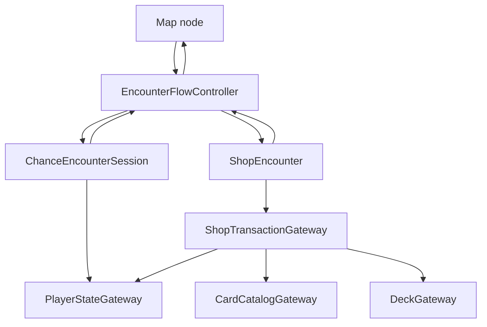

# Team 2 Encounter Resolution and Game Integration

Owner: Guoqing Sun (`@Sunqing050114`)

Parent feature: [#6 — Non-Battle Encounters / Chance Encounters / Shop Encounters](https://github.com/UQcsse3200/2026-studio-3/issues/6)

Supporting evidence:

- [Integration test plan](encounter-integration-test-plan.md)
- [AI use disclosure](encounter-integration-ai-disclosure.md)

## Purpose

This integration layer completes the boundary between Team 2 encounters and the Map, Player, Card
Library, and Deck systems. Chance and Shop code do not directly depend on another team's concrete
storage classes. They communicate through small gateway interfaces, so a later cross-team API
change is isolated to one adapter.

The Sprint 1 demo supports both required routes:

1. `Map -> Chance -> choice -> player health/currency update -> Map`
2. `Map -> Shop -> validate card/price -> add card + deduct currency -> Map`

## Architecture



### API boundaries

| Boundary | Team 2 responsibility | Expected owner implementation |
| --- | --- | --- |
| `PlayerStateGateway` | Read and update health/currency | Team 7 Player components |
| `CardCatalogGateway` | Confirm a card ID exists | Team 6 `CardService#getCard` |
| `DeckGateway` | Add a card and support rollback | Team 5 `PlayerDeck` |
| `ShopTransactionGateway` | Coordinate a transaction safely | Team 2 integration layer |
| `EncounterCallback` | Report node ID and success once | Team 4 Map/Game Flow |

`ComponentPlayerStateAdapter` connects the current `CombatStatsComponent` and
`InventoryComponent`. `FunctionalCardCatalogAdapter`, `FunctionalDeckAdapter`, and
`MapCompletionAdapter` allow the final cross-team implementations to be connected without a Team 2
rewrite.

## Behaviour and consistency rules

### Chance outcomes

- Health and currency changes are validated before either change is retained.
- Currency cannot become negative.
- Lethal health loss is clamped to zero by the Player boundary.
- Integer overflow is rejected.
- If a Player update throws or rejects either requested value, the integration layer attempts to
  restore both original values and reports `ROLLBACK_FAILED` if recovery is incomplete.
- A successful choice can be applied only once. Map completion can also be sent only once.

### Shop transactions

- Item, stock, Card Library, and affordability checks run before mutation.
- The card is added through `DeckGateway`, then currency is committed.
- If adding the card fails, currency and stock remain unchanged.
- If currency update fails, the new card is removed and currency is restored.
- Shop stock decreases only after the complete external transaction succeeds.
- Unknown Card Library IDs are reported as `CARD_NOT_FOUND`, not treated as a successful purchase.

### Map lifecycle

- `EncounterFlowController` permits one active encounter.
- Completion from an unknown/stale node is ignored.
- The controller clears the active session before invoking Map completion, allowing Game Flow to
  launch the next encounter from the callback.
- Successful completion marks the current node complete and unlocks only locked neighbours.
  Already completed nodes are not reopened.
- Cancellation reports `success = false`, returns control, and does not advance progression.

## Current cross-team mappings

The following mappings were checked against the other feature branches on 27 August 2026:

### Team 7 Player

```java
PlayerStateGateway player =
    new ComponentPlayerStateAdapter(combatStatsComponent, inventoryComponent);
```

The adapter uses `CombatStatsComponent#getHealth/setHealth` and
`InventoryComponent#getGold/setGold`.

### Team 6 Card Library

```java
CardCatalogGateway cards =
    new FunctionalCardCatalogAdapter(cardId -> cardService.getCard(cardId).isPresent());
```

Team 6 currently exposes lookup through `CardService#getCard(String)`.

### Team 5 persistent deck

Team 5's current `PlayerDeck#addCard` returns `void`, while `removeCard` returns `boolean`. It can be
adapted without changing Team 2:

```java
DeckGateway deck =
    new FunctionalDeckAdapter(
        cardId -> {
          playerDeck.addCard(cardId);
          return true;
        },
        playerDeck::removeCard);
```

### Team 4 Map

Team 2 currently uses string node IDs, while Team 4's `feature/map` branch currently uses integer
node IDs. The conversion stays in the adapter:

```java
EncounterCallback map =
    new MapCompletionAdapter(
        (nodeId, success) -> mapGraph.onEncounterComplete(Integer.valueOf(nodeId), success));
```

The teams must agree on the final node-ID type before the feature branches merge. No Chance or Shop
class needs to change when that decision is made.

## Test coverage

| Test area | Covered cases |
| --- | --- |
| Chance application | mixed result, insufficient currency, lethal health, overflow, rejected update, rollback failure |
| Shop transaction | success, unknown card, insufficient currency, deck rejection, rollback |
| Encounter lifecycle | Chance completion, Shop completion, cancellation, concurrent-session guard |
| End-to-end | Chance node -> Player update -> Shop unlock -> purchase -> Deck/Player update -> Map unlock |
| Legacy compatibility | Existing `InventoryComponent` Shop constructors remain supported |

Run the verification suite from the repository's `source` directory:

```bash
./gradlew test spotlessCheck
```

## Sprint 1 demo

1. Start the desktop game.
2. The Forest demo launches the initial Chance Encounter through `EncounterFlowController`.
3. Choose the shrine risk/reward option and press **Continue**.
4. Verify that the player's health/currency changes and that the Chance node completes.
5. The Shop opens through the same flow controller.
6. Purchase a valid offer and verify that currency decreases, the card is added, and stock becomes
   zero.
7. Leave the Shop and verify that the Shop node completes and the return node becomes available.
8. Repeat with insufficient currency or an unknown card ID and verify that currency, deck, and
   stock remain unchanged.

## Remaining merge-time checks

- Replace the Sprint 1 `InventoryDeckAdapter` with Team 5's `PlayerDeck` adapter.
- Replace the demo card predicate with Team 6's real `CardService` lookup.
- Resolve the Team 2 string versus Team 4 integer node-ID contract.
- Confirm with Team 3 whether encounters remain overlays or become independent screens.
- Confirm whether leaving a Shop counts as successful completion when no purchase was made.

These checks are intentionally not reported as complete. The final feature must be re-tested after
the Team 2 branch reaches `main`; see the test plan for manual acceptance cases and evidence fields.
